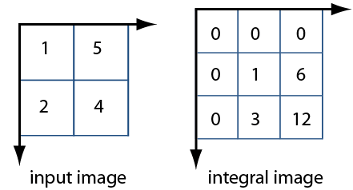
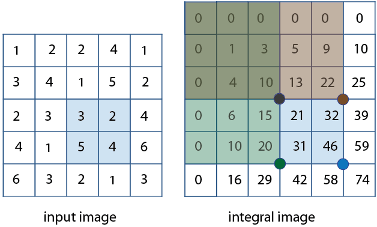

One of the most elegant technical ideas I've encountered was in my computer vision class. We had the following conversation during one lecture:
> Professor: "What's the easiest way to compute the sum of all pixels in an image?"
> 
> Class: "Two for loops."
> 
> Professor: "What about half of the image?"
> 
> Class: "Two for loops over half of the image."
> 
> Professor: "What if I wanted to compute the sum of pixels in any subregion of the image? Iterating over the image is repetitive and costly, especially if the image is large."

This had us stumped. We considered caching computed sums, but that still required performing the work every time a subregion sum wasn't already cached. Professor Wang had just motivated the idea of an integral image. An integral image is a matrix where each entry is the sum of pixels above and to the left of it. This makes it trivially easy to compute the sum of pixels in any subregion.

For example, this is what an original image and its integral image look like:

*Note that the bottom right entry is 12, the sum of all pixels in the image.*

Let's take a more complex example now:

Say we want to compute the sum of this 2x2 region within the 5x5 image. This is trivially easy to compute using the integral image. We start by taking the bottom right corner of the image, 46. This is the sum of the entire region above and to the left of the region we want to compute. Now, we simply subtract 20 and 22 to remove the regions we don't want to find the sum of, and add 10 since we removed the top left region twice. The final computation becomes 46 - 20 - 22 + 10 = 14.

The beauty of this is that we can expand this to images of any size. Computing the integral image initially takes $O(m*n)$ time, but once we have it we can compute any subregion sum in constant time, even if the image is a million pixels wide. This has applications to computer vision problems like object detection, since it lets us make comparisons between millions of features in real-time. Tricks like these are what have allowed complicated computer vision algorithms to run fast enough to be useful. However, even if the integral image had no applications, I still think it's a beautiful algorithm that deserves to be shared.